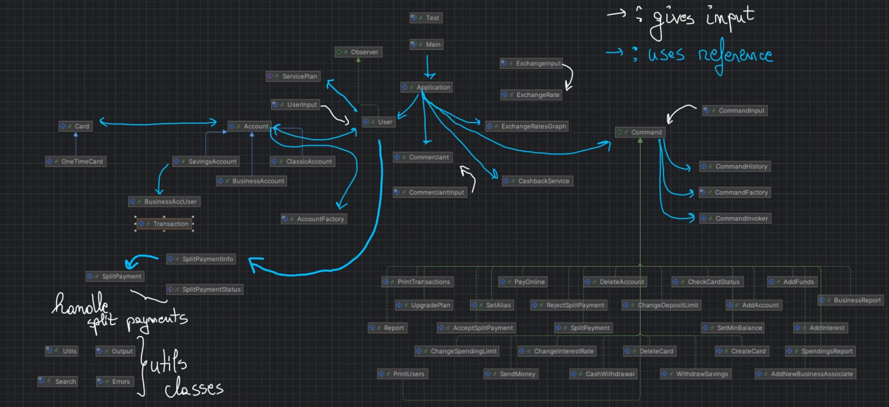

# J. POO Morgan Chase & Co.

**Name:** Simion Marina

**Group:** 321CA

This project simulates a dynamic banking system capable of handling
real-world financial operations such as account management, card transactions,
currency exchanges, and split payments. Built with flexibility in mind,
it leverages design patterns like Command, Factory, and Observer to ensure
scalability and maintainability. Whether it's managing complex business
accounts or performing peer-to-peer transactions, this system provides
a robust solution for modern banking needs.

## Project Structure:

- `src/main/java/org.poo/commands`: Contains concrete command
classes for various operations, as well as the Command interface.
- `src/main/java/org.poo/fileio`: Contains classes for reading
input files
- `src/main/java/org.poo/main`: Contains the entry point of
the application, with multiple subpackages: 'accounts' for the different
types and their creation, 'cardTypes' for the two types of cards and
'splitPayment' for the split payment system.
- `src/main/java/org.poo/utils`: Contains utility classes for
JSON parsing and command execution

## Project flow:

- The input files provide the lists of users, exchange rates and commerciants,
as well as the commands to be executed
- The CommandFactory creates the appropriate command based
on the input from CommandInput
- The CommandInvoker executes the command and returns the result
- The CommandHistory stores the executed commands for future reference
- The Application class manages the flow of the banking operations

## Supported Operations:

- **Account Operations**: Add, delete, or manage accounts, as well as
manage the service plan of a user.
- **Card Operations**: Create, delete, withdraw funds and check the status
of cards.
- **Money Operations**: Transfer funds, add funds, and participate in split
payments(with a system to accept/reject such payments).
- **Interest Management**: Set or change interest rates, add
interest to accounts.
- **Reports**: Generate transaction reports and spendings
reports, as well as user activity logs.
- **Business Operations**: Manage a business account; add other associates
with various roles and permissions, as well as get reports on their activity.

## Components:

### Command Pattern
This application follows the Command Pattern. The Command
interface defines a method execute(), which is implemented
by various concrete command classes like AddAccount,
AddFunds, PayOnline, etc. Each command corresponds to a
specific operation in the banking system. This pattern decouples
command creation from execution.

- Command Interface: Defines a method for executing commands (execute()).
- Concrete Commands: Implement the Command interface and perform the actual operation.
- CommandInvoker: The invoker that delegates the execution
  of commands to the respective command objects.
- CommandFactory: A factory responsible for creating the
  appropriate command based on user input.
- CommandHistory: Stores a history of executed commands.

### Factory Pattern
The Factory Pattern is used to create different types of
objects based on user input. The CommandFactory creates
concrete command objects based on the command name.
The AccountFactory creates different types of accounts
based on the account type given at input. Used to allow for 
flexibility in creating objects and adding new types in the future.

### Singleton Pattern
Used in conjunction with the Factory Pattern to ensure
that only one instance of the CommandFactory and AccountFactory
is created. This ensures that the factories are shared across
the application and that the same instance is used to create
objects.

###  Observer Pattern
The Observer Pattern is used to notify users when all the 
participants in a split payment have accepted or rejected the payment.
The SplitPayment class is the subject, and the User class is the observer.
After all participants have responded, the SplitPayment class notifies
the User class and the logic of the split payment is executed.

### Application Logic
The Application class is the central point of the system.
It is the entry point for all inputs and command execution,
controlling the flow of the banking operations. It holds
references to all users, exchange rates, commands and commerciants.

### Main classes
- **User**: Represents a bank user with accounts and cards. 
It is identified by its email address. It can have multiple
accounts and has a service plan.
- **Account**: Represents a bank account with a balance and
currency. It is associated with a user and identified by
an account number. It can have multiple cards. Currently, there are
three types of accounts: Classic, Savings, and Business, each with different
operations.
- **Card**: Represents a bank card with a status and balance.
It is associated with an account and identified by a card number.
Can either be a normal card or a OneTimeCard.
- **ExchangeRatesGraph**: Represents the graph of all exchange
rates between different currencies.

